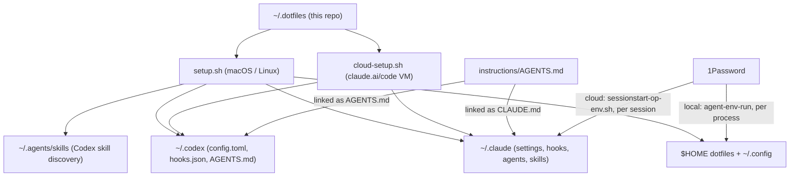

# Architecture overview

The repository is a configuration source, not a running service. Two setup scripts deliver it into
runtime locations that Claude Code, Codex, and the shell discover on their own.

## Delivery

- **Local.** `setup.sh` symlinks repository files into `$HOME`, `~/.claude`, `~/.codex`,
  `~/.agents/skills`, and `~/.config`, installs packages and both agent CLIs, and installs declared
  plugins. It is idempotent and prompts on conflicts. See [setup reference](../reference/setup.md).
- **Cloud.** A tiny shim in each claude.ai/code environment clones this repository and runs
  `cloud-setup.sh` at build time, which recreates the same links as root and installs CLIs and
  plugins. See [cloud environments](../reference/cloud-environments.md).

## Shared sources

| Source                                             | Runtime destination                                  |
| -------------------------------------------------- | ---------------------------------------------------- |
| `instructions/AGENTS.md`                           | `~/.claude/CLAUDE.md`, `~/.codex/AGENTS.md`          |
| `.claude/skills/<name>/` (directory link)          | `~/.claude/skills/<name>`, `~/.agents/skills/<name>` |
| `.codex/skills/code-review`                        | `~/.agents/skills/code-review`                       |
| `.codex/user-config.toml`, `.codex/user-hooks.json` | `~/.codex/config.toml`, `~/.codex/hooks.json`        |

`.claude/` is canonical for shared agents, skills, prompts, and supporting assets; Codex-specific
routers reference those resources rather than copying them.

## Safety layers

Safety is enforced in layers rather than by instruction alone:

- **Permission rules**: Claude `settings.json` allow/ask/deny lists and Codex exec-policy rules.
- **PreToolUse hooks**: protected-file and applied-migration gates, read-only SQL checks, git
  bypass and force-push denies, pnpm enforcement, critical recursive-delete denies, and AWS
  secret protection.
- **Commit and push gates**: secret scanning before commits, plus project quality checks and
  Semgrep SAST before pushes.
- **Credential isolation**: 1Password references are injected per process and never sourced into
  the interactive shell.

How each layer maps between runtimes: [Codex parity reference](../reference/codex-claude-parity.md).
